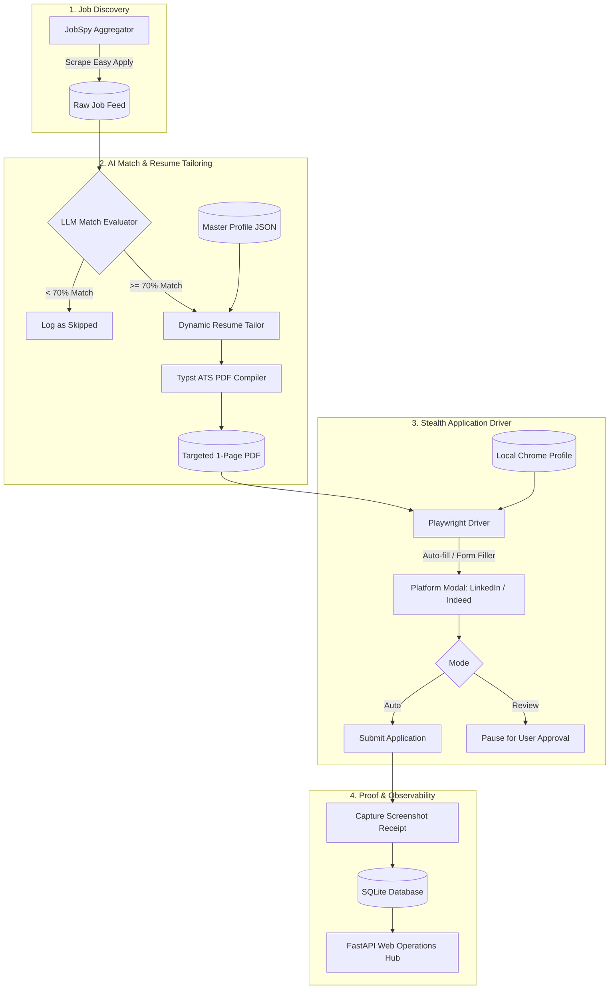

# ⚡ AutoJobForge

<p align="center">
  
  
  
  
  
  
</p>

> **AutoJobForge** is an intelligent, autonomous job application agent and dynamic ATS resume tailoring pipeline built for **LinkedIn** and **Indeed Easy Apply**. It runs 100% locally on your machine, utilizes free-tier LLMs (Gemini / Groq / Ollama), avoids bot bans via persistent Chrome profiles, captures proof screenshot receipts, and gives you a sleek dark-mode Operations Dashboard.

---

## 🌟 Why AutoJobForge?

Applying to hundreds of jobs manually is exhausting, and generic "shotgun" resumes get rejected by modern Applicant Tracking Systems (ATS). 

AutoJobForge solves both problems simultaneously:
1. **Dynamic Keyword & Bullet Alignment:** Instead of submitting a generic PDF, AutoJobForge reads the specific job description, pulls matching experience from your Master Profile, and generates a hyper-targeted resume on the fly.
2. **Deterministic Vector ATS PDF:** Unlike bloated HTML-to-PDF generators, AutoJobForge compiles your customized resume with [Typst](https://typst.app/), producing lightweight, pixel-perfect, 1-page vector PDFs with 100% machine-parseable text layers.
3. **Zero-Ban Residential Stealth:** Rather than launching anonymous headless bots that trigger Cloudflare and LinkedIn security verification, AutoJobForge binds directly to your local, authenticated Google Chrome profile with stealth evasion.
4. **Verifiable Proof Receipts:** Never wonder whether an application actually went through. AutoJobForge saves timestamped confirmation screenshots and records full audit logs in SQLite.

---

## 🏛️ System Architecture



---

## ✨ Core Features

* **🤖 Pluggable AI Client:** Built-in zero-cost support for **Google Gemini 2.0 Flash** (free tier), with seamless fallback to **Groq** (Llama 3.3) or **Ollama** (local offline models).
* **📄 Automated CV Ingestor:** Have an existing resume PDF? Drop it into the dashboard; our AI parser extracts your experience, education, and skills into your editable `master_profile.json`.
* **🎯 Dynamic Resume Tailoring:** Enhances resume summary, highlights matching technical skills, and emphasizes pertinent bullet points for each unique role.
* **🛡️ Stealth Browser Automation:** Employs `playwright-stealth` with native user-agent spoofing, WebGL vendor maskings, and humanized jitter delays.
* **📝 Intelligent Multi-Modal Form Filler:** Answers application questions (years of experience, work authorizations, salary expectations) using contextual reasoning over your master profile.
* **📊 Modern Web Dashboard:** Real-time KPI cards, interactive application history, proof screenshot viewer, and one-click manual batch execution.
* **⏰ Native Windows Scheduler:** Includes a single-click batch script (`setup_task.bat`) to schedule automated applications daily at 9:30 AM without third-party services.
* **🗺️ Graphify Knowledge Graph:** Live interactive dependency and architecture visualization (`graphify-out/graph.html` and `graphify-out/wiki/`) for instant human and AI assistant project orientation.

---

## 🛠️ Tech Stack

| Component | Technology | Rationale |
|---|---|---|
| **Language** | Python 3.11+ | High productivity, rich AI & automation ecosystem |
| **Browser Engine** | Playwright + Playwright-Stealth | Reliable DevTools Protocol control, undetected automation |
| **Job Aggregator** | python-jobspy | Robust multi-portal scraper for LinkedIn & Indeed Easy Apply |
| **Document Compiler** | Typst | Sub-second compilation, native ATS text vectors, 1-page constraints |
| **AI LLMs** | Google Gemini Flash / Groq / Ollama | Free-tier capable, high reasoning capability, fast response |
| **Dashboard** | FastAPI + Jinja2 + Pure CSS | Zero external node_modules bloat, snappy, premium dark-mode UI |
| **Database** | SQLite3 | Embedded, zero-configuration local persistence |
| **Knowledge Graph** | Graphify (Tree-sitter AST) | Persistent code intelligence, God-node detection, interactive HTML map |

---

## 🚀 Getting Started

### 1. Prerequisites
- **Python 3.11+** installed
- **Google Chrome** installed (used for authenticated session persistence)
- Free **Google Gemini API Key** (from [Google AI Studio](https://aistudio.google.com/)) or a **Groq API Key**

### 2. Installation

```bash
# Clone the repository
git clone https://github.com/Shivek25/auto-job-applier.git
cd auto-job-applier

# Create and activate virtual environment
python -m venv venv
.\venv\Scripts\Activate.ps1    # On Windows PowerShell

# Install dependencies
pip install -r requirements.txt
playwright install chromium
```

### 3. Configuration

1. Set your Gemini API key:
   ```powershell
   $env:GEMINI_API_KEY="your-gemini-api-key"
   ```
   *(Or edit `config/config.yaml` to specify your provider and key).*

2. Set up your Master Profile:
   - Copy `config/master_profile.example.json` to `config/master_profile.json` and customize your details, OR
   - Launch the dashboard and upload your existing resume PDF.

---

## 🖥️ Running the System

### Option A: The Web Dashboard (Recommended)

Start the local Operations Hub:
```bash
uvicorn src.web.app:app --reload --port 8000
```
Open [http://localhost:8000](http://localhost:8000) in your browser:
* **Dashboard Tab:** View daily quotas, submission counts, success rates, and view proof screenshot receipts.
* **Profile Studio:** Inspect or update your Master Profile, or upload a new CV to auto-ingest.
* **Settings:** Tweak job search queries, locations, minimum match thresholds, and automation delays.
* **One-Click Batch:** Press **"🚀 Run Daily Batch Now"** to trigger a background job run anytime.

### Option B: Command Line (CLI)

Run directly from your terminal:

```bash
# Run in safe Review Mode (prompts you before final submission on each application)
python run.py --mode review

# Run in Full Autopilot Mode (auto-submits and captures screenshot receipts)
python run.py --mode auto

# Test run with a limit of 3 jobs
python run.py --limit 3 --mode auto
```

### Option C: Automated Daily Scheduling (Windows)

To automatically apply for jobs every weekday morning at 09:30 AM:
```cmd
setup_task.bat
```
This registers a native Windows Scheduled Task (`AutoJobForge_Daily_Runner`) that runs `run.py` quietly in the background.

---

## 🔒 Security & Privacy Guarantees

* **No Cloud Telemetry:** Your resumes, credentials, and application receipts remain strictly on your local disk.
* **Never Commits PII:** The `.gitignore` is pre-configured to ignore `config/master_profile.json`, `config/config.yaml`, database records (`storage/*.db`), and screenshots (`storage/receipts/`).
* **Zero Account Risk:** By leveraging your existing Chrome profile and humanized typing intervals, AutoJobForge operates within regular residential browsing patterns.

---

## 🧪 Testing

AutoJobForge is built with Test-Driven Development (TDD). To run the test suite:

```bash
pytest -v
```

All 16 unit and integration test suites cover:
- Dynamic Typst ATS PDF compilation
- LLM response JSON cleaning and mock fallbacks
- SQLite schema migrations and application deduplication
- Playwright browser context initialization and stealth evasion
- Multi-step form filler decision logic
- FastAPI web dashboard routing and receipts

---

## 📄 License

Distributed under the MIT License. See `LICENSE` for more information.
