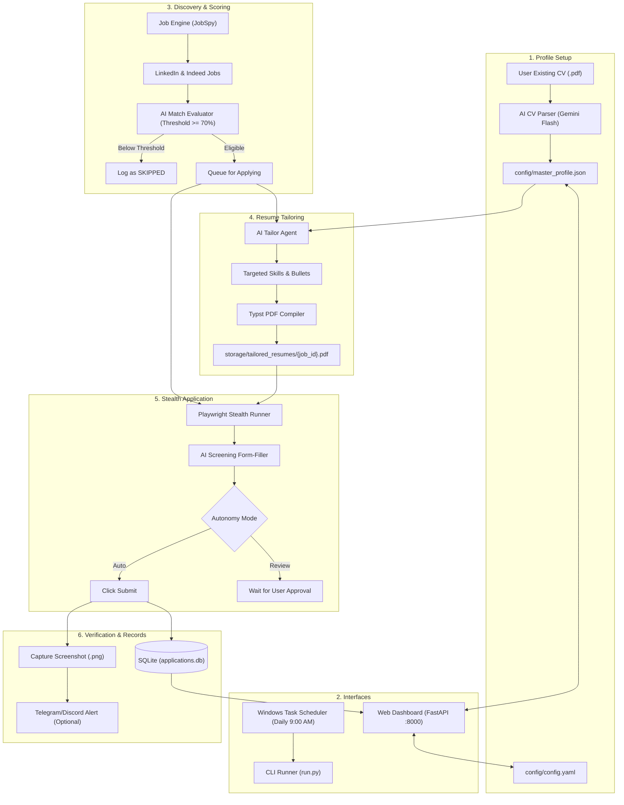

# AutoJobForge: Automated Job Application & Dynamic Resume Tailoring System
## Design Specification

**Date:** 2026-09-30  
**Status:** Approved  
**Author:** Pair programming with User

---

### 1. Overview & Goals

AutoJobForge is a free, local-first, autonomous job application and dynamic resume tailoring system designed to run on Windows. The system eliminates manual job application fatigue by:
1. Ingesting an existing candidate CV (.pdf) into a structured master profile (`master_profile.json`).
2. Scraping relevant job postings from LinkedIn and Indeed using `python-jobspy`.
3. Performing AI semantic match scoring against the job description (JD).
4. Dynamically tailoring skills, summary, and project bullets per JD, and compiling a clean, single-page, ATS-compliant PDF using Typst.
5. Automating multi-step job application forms (LinkedIn Easy Apply & Indeed Quickly Apply) using stealth Playwright connected to the user's existing Chrome session.
6. Verifying submission with DOM completion detection, saving timestamped screenshot receipts, and logging records to an SQLite database.
7. Providing a sleek, modern, dark-mode local Web Dashboard (FastAPI + HTML/CSS) and a headless CLI runner suitable for Windows Task Scheduler.

---

### 2. Architecture & Tech Stack



#### Tech Stack
* **Language:** Python 3.11+
* **Browser Automation:** `playwright`, `playwright-stealth`
* **Scraper:** `python-jobspy` (LinkedIn, Indeed aggregator)
* **LLM Engine:** Pluggable `LLMClient` supporting Google Gemini Flash Free Tier (`google-genai`), Groq API, and local Ollama
* **Document Compilation:** `typst` (via Python package or CLI) for vector-perfect single-page ATS resumes
* **Backend & API:** `fastapi`, `uvicorn`, `jinja2`, `python-multipart`
* **Database:** `sqlite3`
* **Scheduling:** Windows Task Scheduler (`schtasks`) executing `run.py`

---

### 3. Module Specifications

#### 3.1 Ingestion & ATS Resume Compiler (`src/resume/`)
* **`ingestor.py`**:
  * Extracts text from candidate's PDF CV using `pdfplumber`.
  * Sends prompt to LLM to extract structured data matching `MasterProfileSchema`.
  * Saves to `config/master_profile.json`.
* **`tailor.py`**:
  * Receives `master_profile.json` and a target Job Description.
  * Prompts LLM to select top relevant technical skills, adjust the professional summary, and rephrase project bullet points with keywords from the JD without fabricating experience.
* **`compiler.py`**:
  * Renders a Typst file (`templates/modern_ats.typ`) populated with the tailored profile.
  * Compiles directly to `storage/tailored_resumes/{job_id}.pdf`.

#### 3.2 Job Scraper & Match Scoring (`src/scraper/`)
* **`job_fetcher.py`**:
  * Invokes `python-jobspy` to scrape LinkedIn and Indeed based on search query (titles, location, remote flag, days back).
  * Returns normalized job records with `id`, `title`, `company`, `location`, `description`, `job_url`, `platform`.
* **`matcher.py`**:
  * Prompts LLM with the candidate profile and job description.
  * Computes a match score (0–100), key matching highlights, and missing qualifications.
  * Filters jobs against `min_match_score` (default: 70).

#### 3.3 Playwright Stealth Applier (`src/applier/`)
* **`browser.py`**:
  * Launches or connects to Chromium using `user_data_dir` pointing to local Chrome profile, preserving login sessions.
  * Applies `playwright-stealth` evasions to mask automated browser flags.
* **`linkedin.py`**:
  * Navigates to job URL, detects the "Easy Apply" button.
  * Handles multi-step modal: contact info, resume upload (`{job_id}.pdf`), screening questions (numeric, dropdown, radio, open-text answered via LLM), and review step.
  * If mode is `auto`: clicks Submit. If mode is `review`: pauses and beeps/prompts.
* **`indeed.py`**:
  * Navigates to Indeed job URL, clicks "Easily Apply" / "Apply now".
  * Traverses form pages, uploads tailored resume, fills questions, submits.

#### 3.4 Storage & Verification (`src/storage/`)
* **`database.py`**:
  * Initializes SQLite tables:
    * `applications`: `id`, `job_id`, `platform`, `title`, `company`, `location`, `job_url`, `match_score`, `status` (`SUBMITTED`, `FAILED`, `SKIPPED`, `NEEDS_REVIEW`), `applied_at`, `resume_path`, `screenshot_path`, `error_message`.
    * `daily_stats`: `date`, `total_applied`, `total_skipped`, `total_failed`.
* **`verifier.py`**:
  * Detects confirmation UI selectors (`Application submitted`, `Thank you for applying`).
  * Takes a full screenshot saved to `storage/receipts/{company}_{job_id}_{timestamp}.png`.

#### 3.5 Web Dashboard & CLI (`src/web/`, `run.py`)
* **Web UI (`src/web/`)**:
  * FastAPI endpoints:
    * `GET /`: Dashboard homepage with KPI cards (Applications today, All-time total, Success rate), recent submissions table, and live runner status.
    * `GET /profile`: Profile editor for `master_profile.json` with PDF preview.
    * `POST /profile`: Save updated profile.
    * `POST /profile/upload`: Upload PDF CV for initial auto-parsing.
    * `GET /jobs`: Discovered jobs feed and manual apply triggers.
    * `GET /settings`: Edit `config.yaml` (keywords, locations, daily cap, mode).
    * `POST /run`: Trigger immediate batch run in background.
* **CLI Runner (`run.py`)**:
  * Supports flags: `--mode [auto|review]`, `--limit [N]`, `--platform [all|linkedin|indeed]`.
  * Designed for headless execution by Windows Task Scheduler.

---

### 4. Anti-Bot & Account Safety Rules

1. **Daily Volume Cap:** Default maximum of 25 applications per day.
2. **Humanized Delays:**
   * 40ms to 120ms between keystrokes.
   * 2s to 6s pause between form wizard steps.
   * 60s to 180s cooldown between different job submissions.
3. **Session Re-use:** Avoids automated login endpoints by attaching to the user's real browser profile where sessions already exist.
4. **Early Exit on Challenge:** If an unrecognized CAPTCHA or blocking overlay is detected, abort the job, mark it as `FAILED`, and never retry rapidly.

---

### 5. File Structure

```
automatic_job_apply/
├── config/
│   ├── config.yaml
│   └── master_profile.json
├── docs/
│   └── superpowers/
│       ├── specs/
│       │   └── 2026-09-30-autojobforge-design.md
│       └── plans/
│           └── 2026-09-30-autojobforge.md
├── src/
│   ├── __init__.py
│   ├── ai/
│   │   ├── __init__.py
│   │   ├── llm_client.py
│   │   └── prompts.py
│   ├── resume/
│   │   ├── __init__.py
│   │   ├── ingestor.py
│   │   ├── tailor.py
│   │   └── compiler.py
│   ├── scraper/
│   │   ├── __init__.py
│   │   ├── job_fetcher.py
│   │   └── matcher.py
│   ├── applier/
│   │   ├── __init__.py
│   │   ├── browser.py
│   │   ├── form_filler.py
│   │   ├── linkedin.py
│   │   └── indeed.py
│   ├── storage/
│   │   ├── __init__.py
│   │   ├── database.py
│   │   └── verifier.py
│   └── web/
│       ├── __init__.py
│       ├── app.py
│       ├── static/
│       │   ├── css/
│       │   └── js/
│       └── templates/
├── templates/
│   └── modern_ats.typ
├── storage/
│   ├── applications.db
│   ├── receipts/
│   └── tailored_resumes/
├── tests/
│   ├── test_llm_client.py
│   ├── test_resume_tailor.py
│   ├── test_database.py
│   └── test_job_matcher.py
├── run.py
├── setup_task.bat
├── requirements.txt
└── README.md
```
